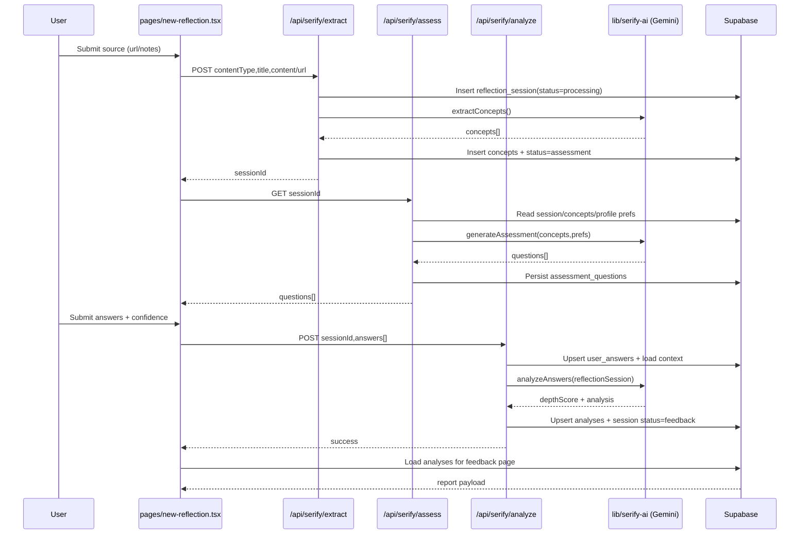

# Serify

Serify is a context-aware learning reflection engine that analyzes content you've consumed — YouTube videos, articles, PDFs, or personal notes — and generates intelligent, scenario-based questions designed not just to test you, but to diagnose how well you actually understand the material.

Unlike typical quiz tools, Serify evaluates both the source content and the quality of your answers to map what you've retained, where understanding is shallow, and where confidence exceeds actual knowledge. The output is a personalized cognitive feedback report that trains active recall and metacognition, directly targeting the illusion of competence (when passive exposure feels like learning).

Serify also supports deliberate learning approaches such as the Feynman method and practice-quiz loops to help users build durable conceptual understanding and transferable skills.

## Core Features

- Content ingestion from URL (YouTube/article) or raw notes
- AI concept extraction with concept graph metadata
- Open-ended diagnostic assessment generation
- Confidence-aware answer submission and analysis
- Feedback report with depth score, insights, and focus suggestions
- Supabase auth/profile/preferences integration

## Tech Stack

- Frontend: Next.js (Pages Router), React, TypeScript, Tailwind CSS
- Backend: Next.js API routes (`/api/serify/*`)
- AI: Google Gemini 2.5 Flash
- Data/Auth: Supabase (Auth + Postgres)

## Environment Variables

Create `.env.local`:

```env
NEXT_PUBLIC_SUPABASE_URL=...
NEXT_PUBLIC_SUPABASE_ANON_KEY=...
NEXT_PUBLIC_SITE_URL=http://localhost:3000
GEMINI_API_KEY=...
```

## Supabase Google Auth Setup

1. In Supabase Dashboard, open **Authentication → Providers → Google** and enable Google.
2. Set Google OAuth credentials (Client ID + Client Secret).
3. In **Authentication → URL Configuration**, add allowed redirect URLs:
    - `http://localhost:3000/dashboard`
    - `https://your-production-domain/dashboard`
4. Ensure `NEXT_PUBLIC_SITE_URL` matches the app domain for the current environment.

## Run

```bash
npm install
npm run dev
```

## Clean Architecture Diagram

```mermaid
flowchart LR
    U[User] --> P[Next.js Pages]
    P --> A[AuthContext]
    A --> SAuth[(Supabase Auth)]

    P --> NR[new-reflection]
    P --> ASSESS[assessment/[id]]
    P --> FB[feedback/[id]]
    P --> DASH[dashboard/profile/history]

    NR --> EX[/api/serify/extract]
    ASSESS --> AQ[/api/serify/assess]
    ASSESS --> AN[/api/serify/analyze]

    EX --> GEM[Gemini via lib/serify-ai]
    AQ --> GEM
    AN --> GEM

    EX --> DB[(Supabase DB)]
    AQ --> DB
    AN --> DB
    FB --> DB
    DASH --> DB
```

## Request Flow Map


